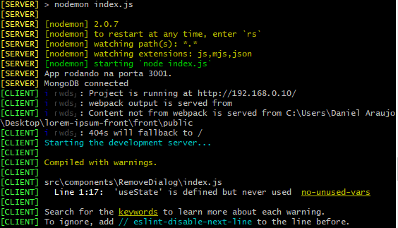
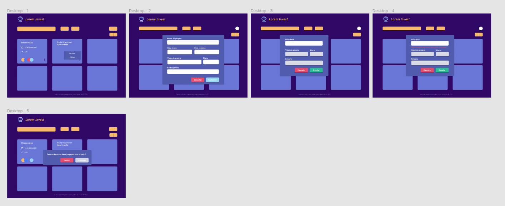

# Welcome to Lorem Invest 👋

## Try it yourself

First, you need to have [Node.js](https://nodejs.org.com) and [React](https://pt-br.reactjs.org/) installed.

Run `npm i` or `yarn start` to install the project dependencies.

Just run `npm start` or `yarn start` which already runs on both the back and the front. 

Navigate to `http://localhost:3000/`. The app will automatically reload if you change any of the source files.

## 🚀 Development tools

- React
- Node.js
- MongoDB

## 🚀 Design tools

- Figma

## Design

 

## Author

👤 **Daniel Araújo**

- GitHub: [@karmodaniel](https://github.com/karmodaniel)
- LinkedIn : [@carmodaniel](https://www.linkedin.com/in/carmodaniel/)
- E-mail: daniel.carmo2008@gmail.com
